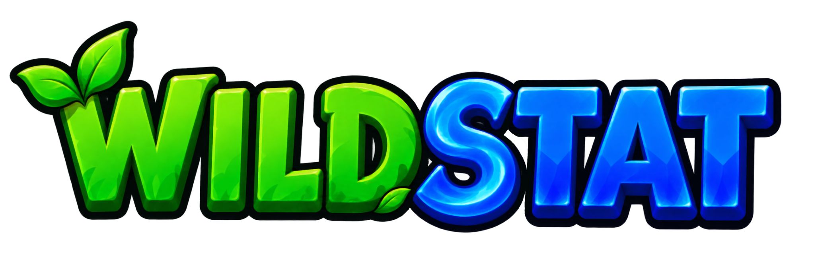

  

<strong>A multiplayer action RPG, right in your browser.</strong>

<a href="https://tydoskus.github.io/wildwood/"><strong>Play Wildstat</strong></a>

Fight monsters, find better gear, and build your stats as you explore forests, deserts, snowlands, and beyond. Take on shared bosses, challenge other players to duels, and see how far you can climb the leaderboard.

Built for phones. Playable on desktop. No download required.

Wildstat is in beta.

Found a bug? Use `/bug` in game or [open an issue](https://github.com/Tydoskus/wildwood/issues).

For local setup and development, see the [development guide](docs/development.md).
