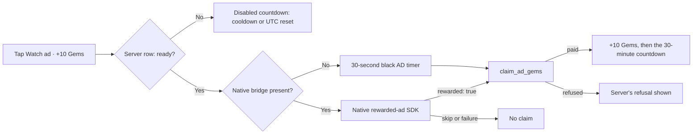

# Rewarded ads

The web game owns the button, the browser placeholder and the claim. An iOS or Android wrapper owns the real ad SDK. A watched ad pays 10 Gems through the `claim_ad_gems` reducer; the server allows one claim every 30 minutes and four per UTC day (the daily Gem bonus's day), and refuses anything else with the wait ("Next ad in 12:34").



Patreon supporters skip the ad and claim with one tap under the same limits. Enemy respawns are no longer part of the reward: every regular enemy respawns in 10 seconds.

## Native bridge contract

Inject `window.wildstatNative` before game startup. If SDK availability changes later, dispatch `wildstat:native-rewarded-ads-changed`.

Older wrappers may continue using `window.wildwoodNative` and `wildwood:native-rewarded-ads-changed`; the browser accepts both while the wrappers migrate. A valid bridge under the new name takes precedence.

```js
window.wildstatNative = {
  platform: "ios", // or "android"
  rewardedAds: {
    isReady: async (placement) => nativeAdSdk.isReady(placement),
    show: async (placement) => {
      const rewarded = await nativeAdSdk.showAndWaitForReward(placement);
      return { rewarded };
    },
  },
};

window.dispatchEvent(new Event("wildstat:native-rewarded-ads-changed"));
```

Placement is `regular_enemy_respawn_2x`, a name kept from the respawn reward so existing wrappers keep working. Return `{ rewarded: true }` only after SDK reward callback. Dismissal, skip, load failure, or playback failure must return `{ rewarded: false }` or reject.

Browser path intentionally simulates one normal 30-second ad and claims the same 10 Gems. The cooldown and the daily count live on the server (`player_ad_reward`, read through `my_ad_gem_reward`), so a refresh, another device or a guest sign-in cannot reset them. If an earned ad's claim fails, the next tap claims it without another ad.
