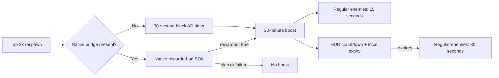

# Rewarded respawn ads

The web game owns button, browser placeholder, reward timer, and regular-enemy respawn rule. An iOS or Android wrapper owns the real ad SDK.



Boss respawns remain server-owned. Reward flow makes no SpacetimeDB calls.

## Native bridge contract

Inject `window.wildwoodNative` before game startup. If SDK availability changes later, dispatch `wildwood:native-rewarded-ads-changed`.

```js
window.wildwoodNative = {
  platform: "ios", // or "android"
  rewardedAds: {
    isReady: async (placement) => nativeAdSdk.isReady(placement),
    show: async (placement) => {
      const rewarded = await nativeAdSdk.showAndWaitForReward(placement);
      return { rewarded };
    },
  },
};

window.dispatchEvent(new Event("wildwood:native-rewarded-ads-changed"));
```

Placement is `regular_enemy_respawn_2x`. Return `{ rewarded: true }` only after SDK reward callback. Dismissal, skip, load failure, or playback failure must return `{ rewarded: false }` or reject.

Browser path intentionally simulates one normal 30-second ad and grants same 30-minute boost. Boost expiry uses wall-clock time and local storage, so refresh or app backgrounding does not erase earned time.
