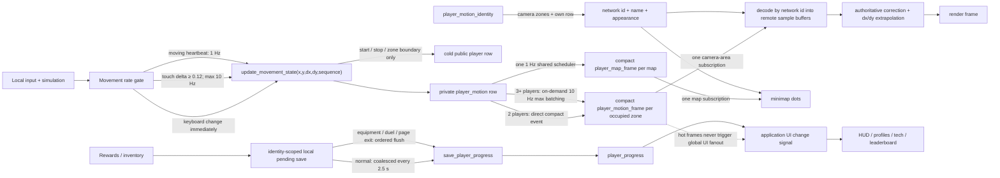
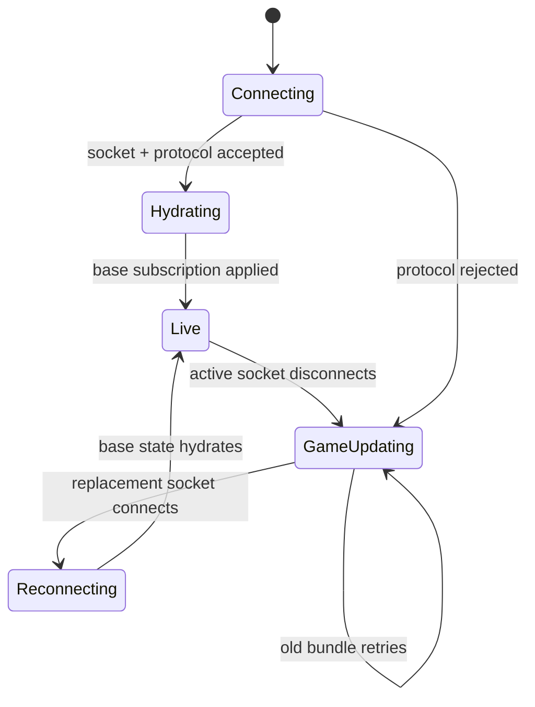
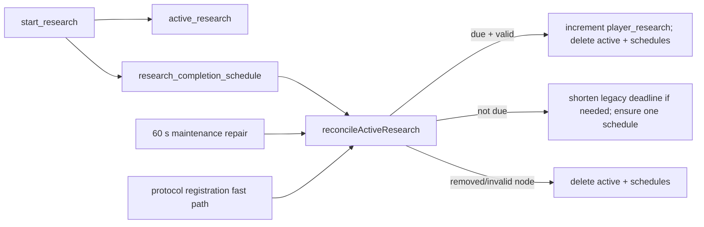
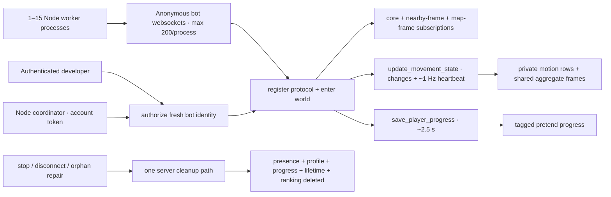

# Realtime Data Flow

Use this map before changing multiplayer state. Wildwood separates fast gameplay data from UI and durable saves so one busy row cannot freeze unrelated windows.

## Runtime lanes

### Lane rules

- `player_motion` is private current motion: client-authoritative `x/y`, normalized `dx/dy`, sequence, and cold compatibility state. Each sender owns its reducer; writes have no public row fanout.
- Keyboard sends only vector transitions plus a one-second moving heartbeat. Touch sends start/stop, vector deltas of at least `0.12`, and the same heartbeat, with material steering capped at 10 Hz. Stationary players send nothing.
- `player_motion_frame` is an insert-only event table. Two-player maps use a direct compact-event fast path. At three or more players, one demand-driven scheduler packs changed movers by zone at no more than 10 Hz. One trailing empty tick ends a burst; no high-rate lease keeps scanning idle motion. Each sample remains 11 bytes, with the retired facing bytes carrying signed `dx/dy`.
- `player` is cold presentation/interest state. It updates on movement start, stop, idle correction, zone crossing, equipment/stat presentation changes, teleports, and lifecycle changes—not every movement input.
- `player_motion_identity` maps compact network IDs to identity, name, account kind, and appearance. Clients subscribe to their own row plus camera zones; distant minimap dots use network ID directly and do not require map-wide profile hydration. Base hydration subscribes only to the local durable profile, never every historical profile/account row.
- `player_map_frame` is one compact 1 Hz snapshot per shared map. It preserves distant minimap dots without N separately updated marker rows or map-wide identity subscriptions.
- Detailed remote players use one subscription containing a rectangular player query and matching zone-frame query derived from actual camera bounds. Never add one subscription per player or one query per zone.
- An invisible developer cannot appear in another client's visible-player query. Sparse state frames remain smooth through vector extrapolation; observation no longer asks every sender for a high-rate stream or requires stationary movement heartbeats.
- Remote players render name and power only. Health remains local simulation state and never enters the realtime player row.
- Normal progress mutations persist locally immediately, then coalesce into one server save. Anything that snapshots equipment, such as a duel, must drain pending progress first.

## Connection state

- `GAME UPDATING` means the server ended or rejected the prior session. Simulation stays paused.
- `RECONNECTING` begins only after a replacement server socket exists and lasts until base data is hydrated.
- Initial subscription rows are read once from the SDK cache in `onApplied`. SpacetimeDB dispatches the same rows' insert callbacks immediately afterward; those duplicate callbacks must stay suppressed.
- Every temporary snapshot/profile/replay subscription needs cancellation on close, switch, disconnect, and a bounded timeout.
- Final disconnect writes private `player_last_location` before removing ephemeral presence. Duel arena coordinates must never become a saved world location.

## Research completion

Scheduled workflows require a repair path. A missing callback, account transfer, timer rebalance, reset, or deploy must converge through maintenance without a client claim button.

## Virtual-player load tests

- Bots must use real connections and normal reducers. Server-side row animation does not measure websocket ingress, reducer acknowledgement, or per-client subscription fanout.
- Authorization accepts only a connected, fresh anonymous identity and caps the test at 3,000 bots. An owner counter enforces that limit in O(1) per bot; never recount the full bot table during startup.
- The browser harness is capped at 200 connections because Chromium limits same-group WebSockets to roughly 255. Large tests use `npm run loadtest:virtual`; automatic sharding keeps at most 200 sockets in each Node process.
- A developer creates one private random capability per run. Node workers receive that capability but never the developer token. Each bot consumes it through its own protocol-confirmed socket, avoiding cross-connection lifecycle races. Bots do not load the on-demand leaderboard during startup.
- Test modes separate costs: `movement` has no subscriptions or saves, `realistic` uses normal subscriptions and saves, and `dense` deliberately concentrates full clients into one zone with rapid steering.
- Nearby-query replacements wait for the old unsubscribe acknowledgement before starting the new query set. This avoids overlapping moving result sets and TypeScript SDK cache-reference races. Socket shutdown does not send redundant per-query unsubscribes immediately before disconnect.
- `virtual_player` remains private. Ranking refresh and access-audit paths skip tagged identities while a test runs.
- Never add a second bot cleanup implementation. Explicit stop, bot disconnect, and maintenance all call `removeVirtualPlayerData` so simulated saves cannot become permanent player data.

## Why aggregation changes scaling

With `N` clustered movers, direct public row updates create roughly `movement Hz × N × N` subscriber deliveries. Aggregate frames create roughly `frame Hz × N` frame deliveries, while each payload contains `N × 11` compact bytes. Sparse ingress also cuts steady straight-line reducer transactions by about 90%:

| Movers | Former 10 Hz ingress | Sparse 1 Hz heartbeat |
|---:|---:|---:|
| 100 | 1,000/s | 100/s |
| 500 | 5,000/s | 500/s |
| 1,000 | 10,000/s | 1,000/s |
| 3,000 | 30,000/s | 3,000/s |

Direction transitions add traffic only when they carry new information. Touch steering may legitimately rise to 3–6/s, or 8–10/s during tight turns. Camera-zone interest still bounds viewer × actor delivery cost.

The 1 Hz minimap remains map-wide but exact payload growth stops at 256 visible players. Above that threshold, the server emits at most 256 spatial centroids. At 3,000 viewers the compact payload is therefore bounded near 8.45 MB/s before protocol overhead instead of 99 MB/s. Runtime zone movement remains exact.

## Server authority boundary

Server owns connection/controller identity, map portals, shared bosses, research timers, duel snapshots/results, visibility, and online counts. Movement stays deliberately client-authoritative. Discrete portal use carries the current client-authoritative `x/y` in the map-change transaction so validation never depends on a one-heartbeat-old motion sample. Server performs only finite-value and world-bound movement sanity checks; it never simulates movement, replays inputs, validates speed/distance, or runs shared player physics.

## Change checklist

1. Decide lane: private input, aggregate frame, cold presence, UI state, snapshot, or durable progress.
2. Keep hot rows out of `onChange` and avoid adding fields that do not need hot cadence.
3. Query only needed identities/maps/zones. Count both subscription handles and queries inside each handle.
4. For scheduled state, add cleanup, idempotence, and maintenance reconciliation.
5. For one-shot loads, cover success, error, close/switch, disconnect, stale connection, and timeout.
6. For schema/reducer changes, bump protocol, build server, regenerate bindings, build client, publish server, then deploy matching client.
7. Run unit tests, typecheck, client build, release check, server build, and `git diff --check`.
