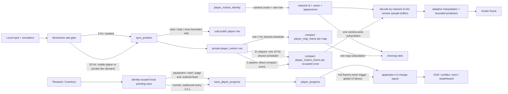
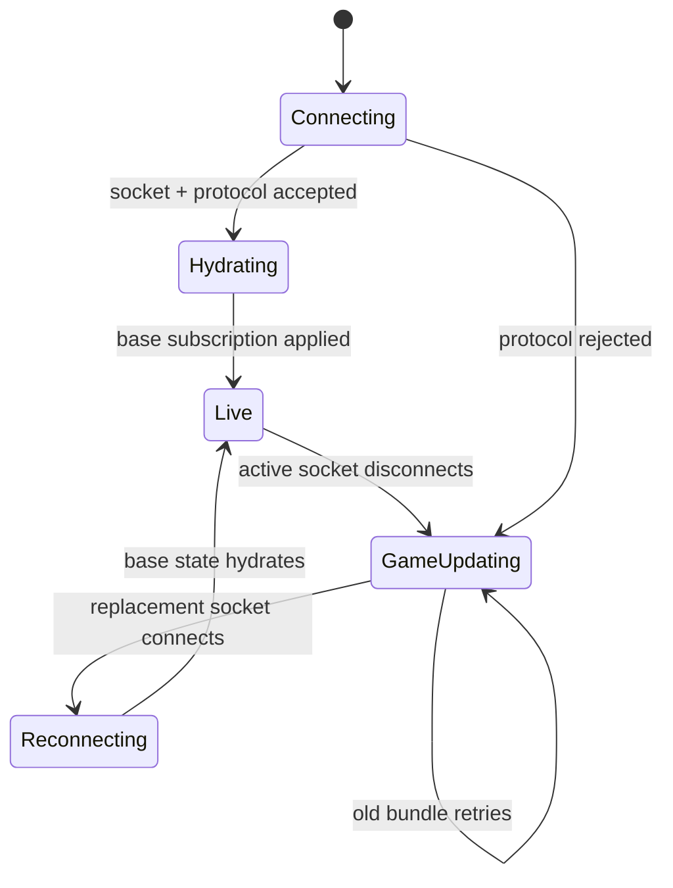
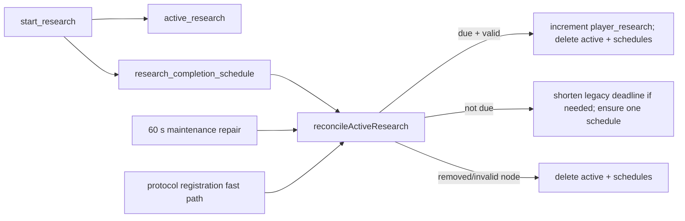
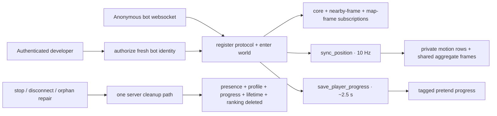

# Realtime Data Flow

Use this map before changing multiplayer state. Wildwood separates fast gameplay data from UI and durable saves so one busy row cannot freeze unrelated windows.

## Runtime lanes

### Lane rules

- `player_motion` is private current motion. Each sender still owns its input reducer, but those writes have no public subscription fanout.
- `player_motion_frame` is an insert-only event table. Two-player maps use a direct compact-event fast path, avoiding extra scheduler transactions at normal population. At three or more players, a single 10 Hz scheduler scans motion once, packs all changed movers by zone, and inserts at most one 11-byte-per-player payload per occupied zone. Low-rate streams restart the scheduler only when input arrives; stalled/background senders cannot keep it spinning. Event rows fire callbacks and are never retained in client caches.
- `player` is cold presentation/interest state. It updates on movement start, stop, idle correction, zone crossing, equipment/stat presentation changes, teleports, and lifecycle changes—not every movement input.
- `player_motion_identity` maps compact network IDs to identity, name, account kind, and appearance. Clients subscribe to their own row plus camera zones; distant minimap dots use network ID directly and do not require map-wide profile hydration. Base hydration subscribes only to the local durable profile, never every historical profile/account row.
- `player_map_frame` is one compact 1 Hz snapshot per shared map. It preserves distant minimap dots without N separately updated marker rows or map-wide identity subscriptions.
- Detailed remote players use one subscription containing a rectangular player query and matching zone-frame query derived from actual camera bounds. Never add one subscription per player or one query per zone.
- An invisible developer cannot appear in another client's visible-player query. Private `player_movement_demand` rows and the identity-scoped `local_movement_demand` view request smooth movement without revealing the observer. Demand is a 20-second visible-tab lease; a cheap stationary heartbeat renews it, while background tabs expire automatically.
- Remote players render name and power only. Health remains local simulation state and never enters the realtime player row.
- Normal progress mutations persist locally immediately, then coalesce into one server save. Anything that snapshots equipment, such as a duel, must drain pending progress first.

## Connection state

- `GAME UPDATING` means the server ended or rejected the prior session. Simulation stays paused.
- `RECONNECTING` begins only after a replacement server socket exists and lasts until base data is hydrated.
- Initial subscription rows are read once from the SDK cache in `onApplied`. SpacetimeDB dispatches the same rows' insert callbacks immediately afterward; those duplicate callbacks must stay suppressed.
- Every temporary snapshot/profile/replay subscription needs cancellation on close, switch, disconnect, and a bounded timeout.
- Final disconnect writes private `player_last_location` before removing ephemeral presence. Duel arena coordinates must never become a saved world location.

## Research completion

Scheduled workflows require a repair path. A missing callback, account transfer, timer rebalance, reset, or deploy must converge through maintenance without a client claim button.

## Virtual-player load tests

- Bots must use real connections and normal reducers. Server-side row animation does not measure websocket ingress, reducer acknowledgement, or per-client subscription fanout.
- Authorization accepts only a connected, fresh anonymous identity and caps the test at 3,000 bots. An owner counter enforces that limit in O(1) per bot; never recount the full bot table during startup.
- A developer creates one private random capability per run. Each bot consumes it through its own protocol-confirmed socket, avoiding cross-connection lifecycle races. Startup is sequential, acknowledgement-aware, and retries transient failures before counting a bot as failed.
- `virtual_player` remains private. Ranking refresh and access-audit paths skip tagged identities while a test runs.
- Never add a second bot cleanup implementation. Explicit stop, bot disconnect, and maintenance all call `removeVirtualPlayerData` so simulated saves cannot become permanent player data.

## Why aggregation changes scaling

With `N` clustered movers, direct public row updates create roughly `movement Hz × N × N` subscriber deliveries. Aggregate frames create roughly `frame Hz × N` frame deliveries, while each payload contains `N × 11` compact bytes. This removes per-row transaction metadata and repeated identity/profile strings from the hot lane. Total position bytes still grow with viewers × visible actors; camera-zone interest keeps that set bounded in normal play.

The 1 Hz minimap remains intentionally map-wide. At extreme synthetic counts, its payload is still viewers × map population. If real maps approach thousands of concurrent players, replace exact far-player dots with capped samples, density cells, or party/friend-only markers.

## Server authority boundary

Server owns connection/controller identity, map portals, shared bosses, research timers, duel snapshots/results, visibility, and online counts. Movement coordinates remain client-trusted by current product choice; this refactor changes replication cost, not movement authority. Regular enemies and most stat rewards are also client-simulated, so `save_player_progress` remains a low-trust boundary. Before a large public beta, replace arbitrary stat snapshots with server-issued reward/inventory reducers and add movement-distance validation.

## Change checklist

1. Decide lane: private input, aggregate frame, cold presence, UI state, snapshot, or durable progress.
2. Keep hot rows out of `onChange` and avoid adding fields that do not need hot cadence.
3. Query only needed identities/maps/zones. Count both subscription handles and queries inside each handle.
4. For scheduled state, add cleanup, idempotence, and maintenance reconciliation.
5. For one-shot loads, cover success, error, close/switch, disconnect, stale connection, and timeout.
6. For schema/reducer changes, bump protocol, build server, regenerate bindings, build client, publish server, then deploy matching client.
7. Run unit tests, typecheck, client build, release check, server build, and `git diff --check`.
