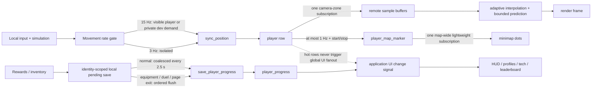
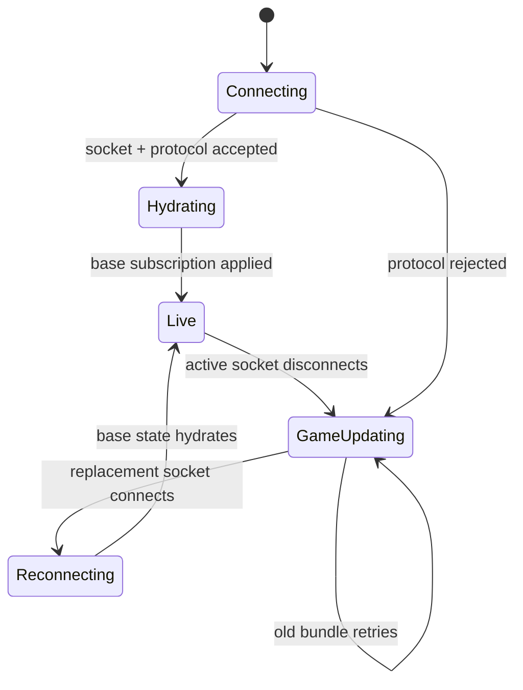
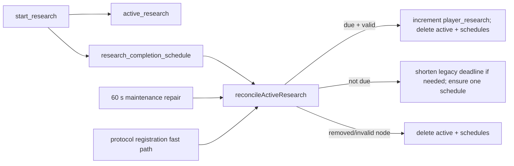

# Realtime Data Flow

Use this map before changing multiplayer state. Wildwood separates fast gameplay data from UI and durable saves so one busy row cannot freeze unrelated windows.

## Runtime lanes

### Lane rules

- `player` is hot state: position, appearance summary, and presence. Frame code reads its caches directly. Movement updates must not run the application-wide UI refresh path.
- `player_map_marker` is cheap, map-wide minimap state. It contains no combat data and updates at most once per second, plus movement start/stop and map changes.
- Detailed remote players use one rectangular map/visibility/zone query derived from actual camera bounds. Never add one subscription per player or one query per zone.
- An invisible developer cannot appear in another client's visible-player query. Private `player_movement_demand` rows and the identity-scoped `local_movement_demand` view request smooth movement without revealing the observer. Demand is a 20-second visible-tab lease; a cheap stationary heartbeat renews it, while background tabs expire automatically.
- Remote players render name and power only. Health remains local simulation state and never enters the realtime player row.
- Normal progress mutations persist locally immediately, then coalesce into one server save. Anything that snapshots equipment, such as a duel, must drain pending progress first.

## Connection state

- `GAME UPDATING` means the server ended or rejected the prior session. Simulation stays paused.
- `RECONNECTING` begins only after a replacement server socket exists and lasts until base data is hydrated.
- Initial subscription rows are read once from the SDK cache in `onApplied`. SpacetimeDB dispatches the same rows' insert callbacks immediately afterward; those duplicate callbacks must stay suppressed.
- Every temporary snapshot/profile/replay subscription needs cancellation on close, switch, disconnect, and a bounded timeout.
- Final disconnect writes private `player_last_location` before removing ephemeral presence. Duel arena coordinates must never become a saved world location.

## Research completion

Scheduled workflows require a repair path. A missing callback, account transfer, timer rebalance, reset, or deploy must converge through maintenance without a client claim button.

## Virtual-player load tests

- Bots must use real connections and normal reducers. Server-side row animation does not measure websocket ingress, reducer acknowledgement, or per-client subscription fanout.
- Authorization accepts only a connected, fresh anonymous identity and caps the test at 3,000 bots. An owner counter enforces that limit in O(1) per bot; never recount the full bot table during startup.
- `virtual_player` remains private. Ranking refresh and access-audit paths skip tagged identities while a test runs.
- Never add a second bot cleanup implementation. Explicit stop, bot disconnect, and maintenance all call `removeVirtualPlayerData` so simulated saves cannot become permanent player data.

## Server authority boundary

Server owns connection/controller identity, map portals, shared bosses, research timers, duel snapshots/results, visibility, and online counts. Regular enemies and most stat rewards are still client-simulated; `save_player_progress` therefore remains a low-trust boundary. Before a large public beta, replace arbitrary stat snapshots with server-issued reward/inventory reducers and add movement-distance validation.

## Change checklist

1. Decide lane: per-frame cache, lightweight marker, UI state, snapshot, or durable progress.
2. Keep hot rows out of `onChange` and avoid adding fields that do not need hot cadence.
3. Query only needed identities/maps/zones. Count both subscription handles and queries inside each handle.
4. For scheduled state, add cleanup, idempotence, and maintenance reconciliation.
5. For one-shot loads, cover success, error, close/switch, disconnect, stale connection, and timeout.
6. For schema/reducer changes, bump protocol, build server, regenerate bindings, build client, publish server, then deploy matching client.
7. Run unit tests, typecheck, client build, release check, server build, and `git diff --check`.
