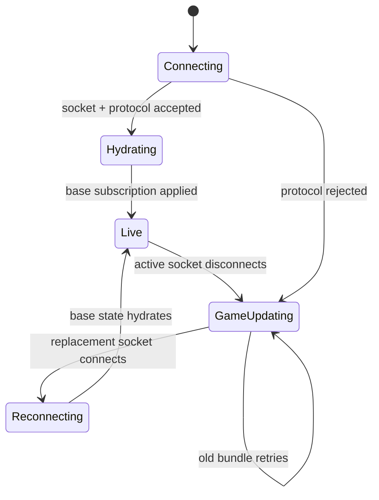
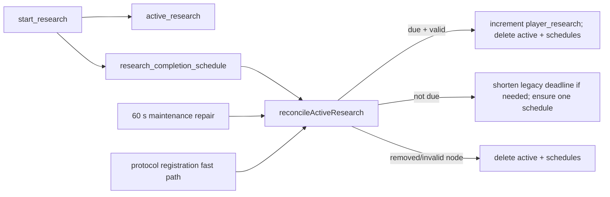
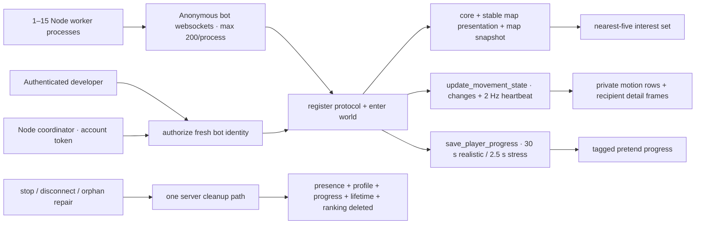

# Realtime Data Flow

Use this map before changing multiplayer state. Wildwood separates fast gameplay data from UI and durable saves so one busy row cannot freeze unrelated windows.

## Runtime lanes

```mermaid
flowchart LR
  Input["Local input + simulation"] --> PositionGate["Movement rate gate"]
  PositionGate -->|"keyboard change immediately"| PositionReducer["update_movement_state(x,y,vx,vy,tick,epoch,sequence)"]
  PositionGate -->|"touch: 24-direction-equivalent gate; max 10 Hz"| PositionReducer
  PositionGate -->|"moving heartbeat: 2 Hz"| PositionReducer
  PositionReducer --> PrivateMotion["private player_motion analytical anchor"]
  PrivateMotion --> Sample["sample x/y at publisher timestamp"]
  Sample --> DetailPublisher["3 Hz recipient-frame publisher"]
  MapBatch --> Interest["client selects nearest five with hysteresis"]
  Interest -->|"membership changes only"| InterestReducer["set_player_motion_interest"]
  InterestReducer --> DetailPublisher
  DetailPublisher -->|"one identity-filtered frame · ≤5 actors"| MotionCache["decode by network id into remote sample buffers"]
  MotionCache --> Interpolation["continuity anchor + transmitted-velocity extrapolation"]
  Interpolation --> Frame["render frame"]

  PositionReducer -->|"start / stop / idle correction only"| PlayerRow["exact-own player row"]
  Sample -->|"one 1 Hz shared scheduler"| MapBatch["compact player_map_frame per map"]
  MapBatch -->|"one map subscription"| Minimap["minimap dots"]

  Presence["stable player_motion_identity presentation"] -->|"one map-scoped subscription"| IdentityCache["network id + name + appearance + equipment"]
  IdentityCache --> MotionCache
  IdentityCache --> Minimap

  Rewards["Rewards / inventory"] --> Pending["identity-scoped local pending save"]
  Pending -->|"normal: coalesced every 2.5 s"| ProgressReducer["save_player_progress"]
  Pending -->|"equipment / duel / page exit: ordered flush"| ProgressReducer
  ProgressReducer --> ProgressRow["player_progress"]
  ProgressReducer -->|"visible stats/equipment changed"| Presence

  DetailPublisher -. "hot frames never trigger global UI fanout" .-> UiSignal["application UI change signal"]
  ProgressRow --> UiSignal
  UiSignal --> Windows["HUD / profiles / tech / leaderboard"]
```

### Lane rules

- `player_motion` is a private analytical anchor: client-authoritative `x/y`, world-space `vx/vy`, sender simulation tick, motion epoch, sequence, and anchor time. Each sender owns its reducer; writes have no public row fanout.
- Keyboard sends only velocity transitions plus a 500 ms moving heartbeat. Touch compares squared magnitudes and a dot product against a 24-direction-equivalent hysteresis gate, then sends exact `vx/vy`; local movement remains fully analog. Material steering is capped at 10 Hz. Stationary players send nothing.
- Remote presentation treats the 3 Hz nearby frame as correction cadence, not network jitter. It keeps a deliberate roughly 220–240 ms presentation buffer, anchors each correction to the pose already being shown, preserves the stationary anchor when movement starts, and clamps correction at a confirmed stop. The per-render predictor extrapolates directly from transmitted world velocity instead of reconstructing speed from old-position deltas.
- `motionEpoch` is the only hard discontinuity guard. Respawns, world/session resets, map transitions, and duel teleports advance it and flush the old prediction buffer. Distance never decides whether valid fast travel was a teleport. The wrap-aware 16-bit hot `simulationTick` reconstructs sender cadence; server time remains the fallback across epochs.
- Both publishers analytically advance anchors to their shared publication timestamp before packing them. The server does not run a per-player tick or write the sampled pose back. A 1.5-second grace horizon turns stale anchors into a bounded stopped pose.
- `player_motion_detail_frame` is an insert-only event table filtered by recipient identity. One 3 Hz scheduler performs at most five indexed motion lookups per interested viewer and packs those samples into a single frame. Each sample is 16 bytes: network ID, quantized `x/y`, quantized `vx/vy`, low 16 bits of simulation tick, and low 16 bits of motion epoch.
- `player` is exact-own lifecycle and compatibility state. It updates on movement start, stop, idle correction, presentation changes, teleports, and lifecycle changes—not on heartbeats or zone crossings. Current clients never subscribe to remote rows.
- `player_motion_identity` is the stable map-wide presentation cache: compact network ID, identity, name, account kind, appearance, speed, power, and equipment. Clients subscribe once per map; movement and camera motion never update or replace this subscription. Physical zone columns remain migration compatibility only. Base hydration subscribes only to the local durable profile, never every historical profile/account row.
- `player_map_frame` is one compact 1 Hz snapshot per shared map. Its separate 8-byte sample carries only network ID and `x/y`; prediction-only velocity, tick, and epoch never inflate distant markers.
- Detailed remote players use the stable presentation cache plus one recipient-frame query. The all-map snapshot selects at most five relevant network IDs before server serialization and may seed a fresh initial pose while detail connects; an unconfirmed detail lane resubmits its bounded interest and replaces the single recipient subscription. Never create one subscription handle per selected player.
- An invisible developer cannot appear in another client's visible-player query. Sparse state frames remain smooth through vector extrapolation; observation no longer asks every sender for a high-rate stream or requires stationary movement heartbeats.
- Remote players normally render name and power only. Actual health remains local simulation state and never enters the realtime player row.
- Regular enemies use the existing frame \`emittedAt\` timestamps and detailed motion samples for a versioned client-only deterministic timeline. A remote fight uses a separate translucent enemy copy created only when either enemy proximity or that player's exact saved attack range reaches the encounter; its short-lived stat snapshot comes from existing progress/research/upgrade tables and never changes the solid local enemy or durable combat state. See \`docs/regular-enemy-simulation.md\`.
- Normal progress mutations persist locally immediately, then coalesce into one server save. Anything that snapshots equipment, such as a duel, must drain pending progress first.

## Connection state

- `GAME UPDATING` means the server ended or rejected the prior session. Simulation stays paused.
- `RECONNECTING` begins only after a replacement server socket exists and lasts until base data is hydrated.
- Initial subscription rows are read once from the SDK cache in `onApplied`. SpacetimeDB dispatches the same rows' insert callbacks immediately afterward; those duplicate callbacks must stay suppressed.
- Every temporary snapshot/profile/replay subscription needs cancellation on close, switch, disconnect, and a bounded timeout.
- Final disconnect writes private `player_last_location` before removing ephemeral presence. Duel arena coordinates must never become a saved world location.

## Research completion

Scheduled workflows require a repair path. A missing callback, account transfer, timer rebalance, reset, or deploy must converge through maintenance without a client claim button.

## Virtual-player load tests

- Bots must use real connections and normal reducers. Server-side row animation does not measure websocket ingress, reducer acknowledgement, or per-client subscription fanout.
- Authorization accepts only a connected, fresh anonymous identity and caps the test at 3,000 bots. An owner counter enforces that limit in O(1) per bot; never recount the full bot table during startup.
- The browser harness is capped at 200 connections because Chromium limits same-group WebSockets to roughly 255. Large tests use `npm run loadtest:virtual`; automatic sharding keeps at most 200 sockets in each Node process.
- A developer creates one private random capability per run. Node workers receive that capability but never the developer token. Each bot consumes it through its own protocol-confirmed socket, avoiding cross-connection lifecycle races. Bots do not load the on-demand leaderboard during startup.
- Test modes isolate `movement`, `core`, `map`, capped detail, persistence, realistic, and dense-crowd costs. The 2.5-second fabricated save belongs only to persistence stress; realistic saves dirty progress every 30 seconds.
- Bots install the same stable map presentation cache as production and choose nearest-five interest from decoded `player_map_frame` events. They never derive selection from broad public player rows or move subscriptions with simulated camera zones.
- `virtual_player` remains private. Ranking refresh and access-audit paths skip tagged identities while a test runs.
- Never add a second bot cleanup implementation. Explicit stop, bot disconnect, and maintenance all call `removeVirtualPlayerData` so simulated saves cannot become permanent player data.

## Why aggregation changes scaling

With `N` clustered movers, zone-wide detail creates roughly `N × (N - 1)` actor-to-viewer deliveries per sample interval. A five-actor recipient cap changes that term to at most `N × 5`:

| Players | Zone-wide detail pairs | Five-actor pairs | Reduction |
|---:|---:|---:|---:|
| 100 | 9,900 | 500 | 19.8× |
| 500 | 249,500 | 2,500 | 99.8× |
| 1,000 | 999,000 | 5,000 | 199.8× |
| 3,000 | 8,997,000 | 15,000 | 599.8× |

Sparse ingress still cuts steady straight-line reducer transactions by 80%:

| Movers | Former 10 Hz ingress | Sparse 2 Hz heartbeat |
|---:|---:|---:|
| 100 | 1,000/s | 200/s |
| 500 | 5,000/s | 1,000/s |
| 1,000 | 10,000/s | 2,000/s |
| 3,000 | 30,000/s | 6,000/s |

Direction transitions add ingress only when they carry new information. The
recipient publisher keeps egress bounded independently of sender steering rate.
The stable presentation cache makes every active-map network ID eligible without
turning identity or equipment into hot movement data.

The 1 Hz minimap remains map-wide but exact payload growth stops at 256 visible players. Above that threshold, the server emits at most 256 spatial centroids. At 3,000 viewers its 8-byte samples are therefore bounded near 6.14 MB/s before protocol overhead instead of the former 8.45 MB/s. Selected detailed movement remains exact.

## Server authority boundary

Server owns connection/controller identity, map portals, shared boss HP/damage validation/contributions/results, research timers, duel snapshots/results, visibility, and online counts. Boss pattern geometry and nearby remote-player boss-attack presentation use a versioned encounter seed locally; they never decide authoritative damage or rewards. Movement stays deliberately client-authoritative. Discrete portal use carries the current client-authoritative `x/y` in the map-change transaction so validation never depends on a one-heartbeat-old motion sample. Server performs only finite-value and world-bound movement sanity checks; it never runs an authoritative movement tick, replays inputs, validates speed/distance, or runs shared player physics. Constant-velocity anchor evaluation exists only to timestamp outgoing publications consistently.

## Change checklist

1. Decide lane: private input, aggregate frame, cold presence, UI state, snapshot, or durable progress.
2. Keep hot rows out of `onChange` and avoid adding fields that do not need hot cadence.
3. Query only needed identities and maps. Count both subscription handles and queries inside each handle.
4. For scheduled state, add cleanup, idempotence, and maintenance reconciliation.
5. For one-shot loads, cover success, error, close/switch, disconnect, stale connection, and timeout.
6. For schema/reducer changes, bump protocol, build server, regenerate bindings, build client, publish server, then deploy matching client.
7. Run unit tests, typecheck, client build, release check, server build, and `git diff --check`.

### Follow-up measurement note

If remote motion still diverges on a representative phone, record predicted-versus-confirmed position error, epoch changes, sender tick deltas, and dropped simulation time before changing either the 2 Hz sender heartbeat or 3 Hz nearby publication. An adaptive correction rate remains an option, but it should be justified against reducer ingress and dense-map fanout rather than used to mask a presentation-clock error.

At much larger map populations, measure the one-time presentation snapshot separately from steady traffic. If that join cost becomes material, the next legitimate step is a revisioned request-once presentation catalog or a packed string dictionary—not movement-coupled identity updates, moving subscriptions, or a high-rate server tick. Also measure whether 0.5 Hz map repair plus small deltas beats the current bounded 1 Hz snapshot before changing it.
